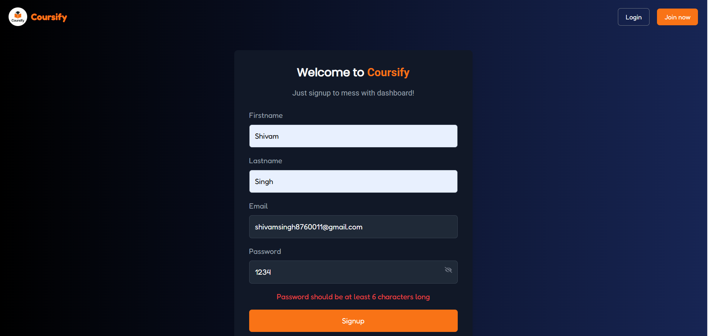
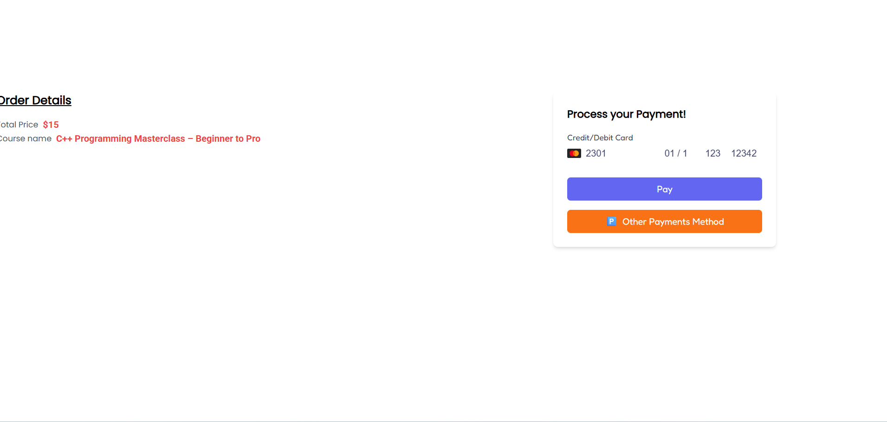
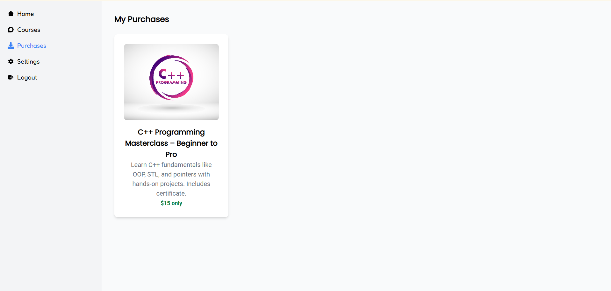
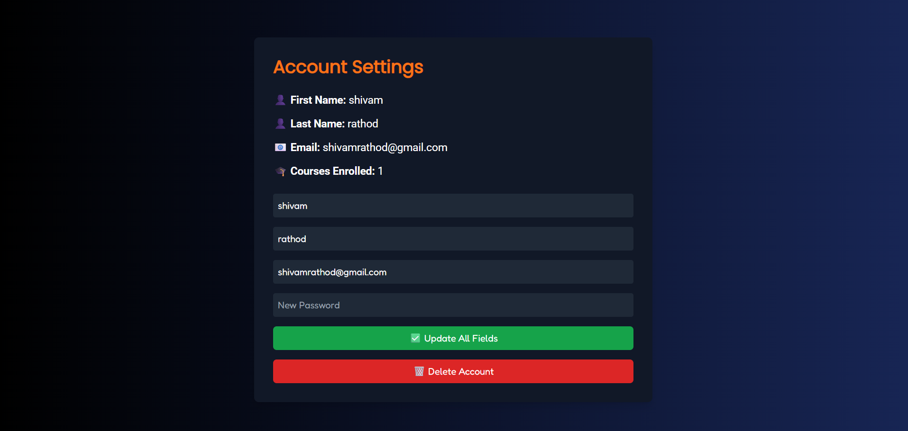
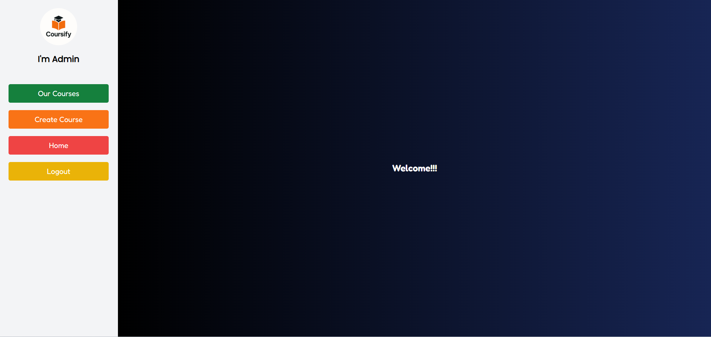
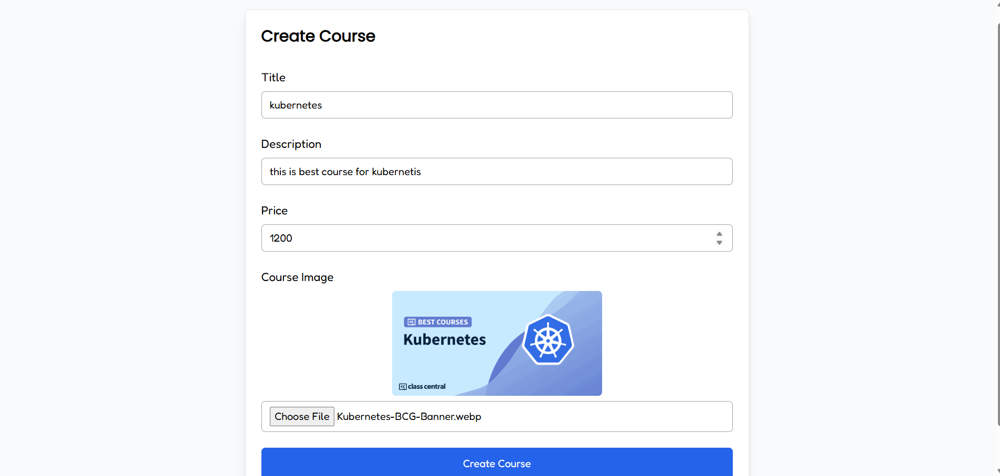
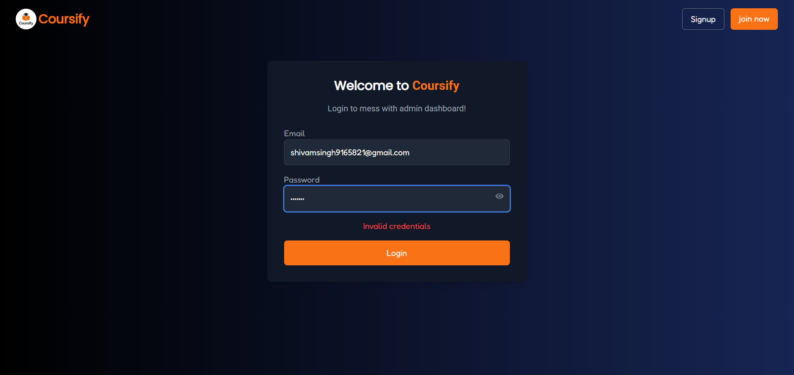

# 🚀 Coursify

Coursify is a **responsive full-stack course-selling platform** where users can explore, purchase, and access courses, while admins can manage courses through a dedicated dashboard.

The platform provides **secure authentication, smooth UI interactions, and an admin panel for course management**.

---

# ⚠️ Backend Hosting Note

The backend server is hosted on **Render's free tier**.

Because of this, the server **goes to sleep when inactive**.  
So the **first request may take around 1 minute** while the backend wakes up.

After the first request, the application works normally and responses become fast.

---

# ✨ Features

## 👨‍🎓 User Features
- Browse available courses
- Secure authentication (Signup / Login)
- Purchase courses
- Access purchased courses
- Watch course videos
- Manage account settings

## 👨‍💻 Admin Features
- Admin authentication
- Admin dashboard
- Create new courses
- Manage existing courses

---

# 🛠 Tech Stack

## Frontend
- React.js
- CSS
- Axios

## Backend
- Node.js
- Express.js

## Database
- MongoDB

## Authentication
- JWT (JSON Web Token)

## Validation
- Zod

---

# 📸 Screenshots

## 🏠 Home Page
Landing page where users can explore featured courses.

---

## 🔐 Authentication (Signup / Login)

Users can securely create an account and log in.

---

## 📚 Available Courses

Users can browse all available courses.

---

## 🎥 Course Video Page

After purchasing a course, users can watch the course videos.

---

## 💳 Course Purchase

Secure course purchase flow integrated with payment.

---

## 📦 Purchased Courses

Users can view courses they have already purchased.

---

## ⚙️ User Settings

Users can manage their account settings.

---

## 📊 Admin Dashboard

Admin panel for managing courses.

---

## ➕ Admin Create Course

Admins can create new courses through the dashboard.

---

## ✅ Zod Validation

Form validation implemented using Zod for better input handling.

---

# 📈 Future Improvements

- Add course ratings and reviews
- Add instructor profiles
- Implement course progress tracking
- Improve recommendation system

---

# 👨‍💻 Author

**Shivam Kumar Singh**

B.Tech Computer Science – BIT Sindri  
Competitive Programmer

Codeforces  
https://codeforces.com/profile/shivamsingh987

GeeksforGeeks  
https://www.geeksforgeeks.org/profile/shivamsin37xn

LinkedIn  
https://www.linkedin.com/in/shivam-singh-4131b5251/

---

⭐ If you found this project interesting, consider giving it a star.
